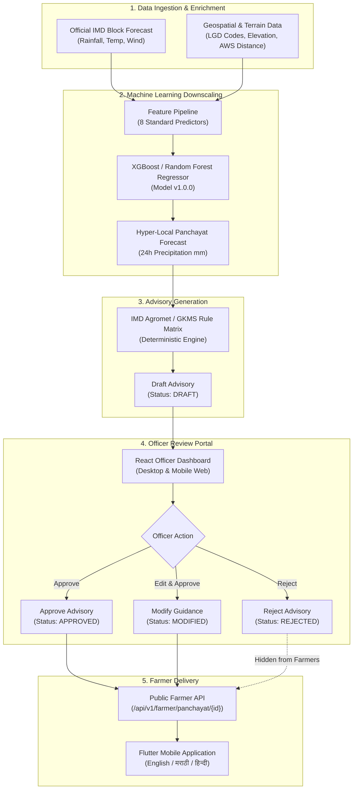
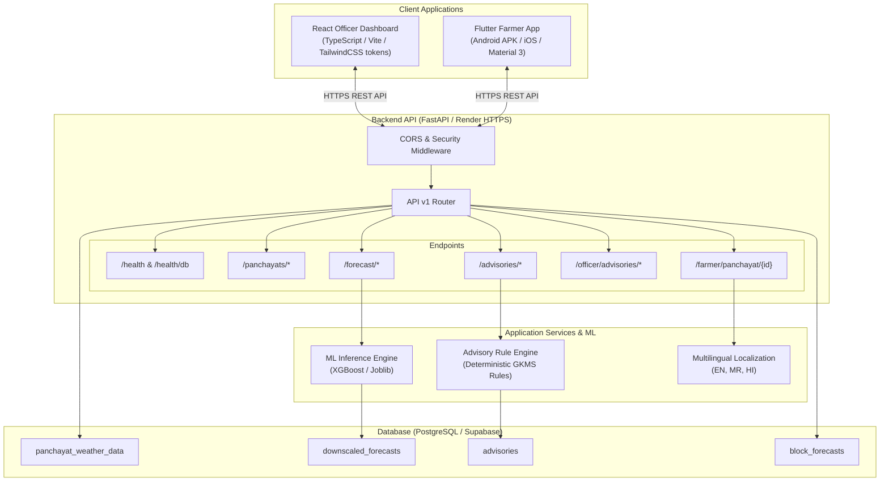

# GramSevak

> **Smart India Hackathon (SIH26074)**  
> **Problem Statement**: *"Downscaling of weather forecast from Block level to Panchayat level: Inferring high-resolution plots/data/information from low-resolution variables for agro-meteorological advisory services."*  
> **Organization**: Ministry of Earth Sciences (MoES)  
> **Department**: India Meteorological Department (IMD)  
> **Theme**: Agriculture, FoodTech & Rural Development  

**GramSevak** is an end-to-end agro-meteorological intelligence platform designed to bridge the resolution gap between regional numerical weather predictions and hyper-local agricultural decision-making. In India, official weather forecasts are issued at the **Block level** (coarse 25–50 km grid), yet agricultural risks such as pesticide wash-off, frost damage, and localized downpours vary sharply across individual village clusters. GramSevak ingests official India Meteorological Department (IMD) block forecasts, enriches them with high-resolution geospatial features (digital elevation models, coordinates, terrain roughness, and station proximity), and employs machine learning to generate calibrated **Panchayat-level forecasts** (3–8 km resolution). These micro-forecasts feed into a deterministic agronomic rule engine that synthesizes crop-specific advisories, which are submitted to local agricultural extension officers for human-in-the-loop review and approval before delivery to farmers via a native multilingual mobile application.

---

## 🌐 Live Deployments & Cloud Endpoints

| Service | Platform | Live URL | Description |
| :--- | :--- | :--- | :--- |
| **Officer Dashboard (Frontend)** | Vercel | [https://gramsevak.vercel.app/](https://gramsevak.vercel.app/) | Responsive React web portal for agricultural extension officers to monitor Panchayat downscaled forecasts and review/approve advisories |
| **GramSevak Backend API** | Render | [https://gramseva-0etv.onrender.com/](https://gramseva-0etv.onrender.com/) | Live FastAPI production REST API, ML inference engine, and interactive OpenAPI documentation ([/docs](https://gramseva-0etv.onrender.com/docs)) |

---

## 1. Problem Statement

### The Resolution Dilemma
Official numerical weather predictions issued by the India Meteorological Department (IMD) and Agromet Advisory Services operate primarily at the **District and Block levels** (typically a 25 km to 50 km spatial grid). While effective for broad synoptic weather monitoring, block-level forecasts possess significant limitations for village-level agricultural management:
- **Topographical & Orographic Variation**: Within a single administrative block covering hundreds of square kilometers, elevations can vary by several hundred meters, resulting in micro-climatic rain shadows and elevation-driven precipitation differentials.
- **Micro-Scale Agricultural Impact**: Decisions such as chemical spraying, fertilizer application, irrigation scheduling, seed sowing, and harvest protection depend on localized conditions over a 24–48 hour window. A forecast of "light regional showers" at the block level may manifest as a destructive 40 mm downpour in an elevated village or zero rain in the valley.
- **Economic Loss from Misaligned Advice**: Generic block advisories can lead farmers to apply costly pesticides right before a localized rainstorm (causing chemical wash-off and economic loss) or withhold irrigation based on regional rain predictions that never materialize in their village.

### The Role of Agro-Meteorological Advisories
Localized agro-meteorological advisories translate raw meteorological variables (precipitation, temperature, humidity, wind) into plain-language, actionable guidance. For smallholder farmers, receiving verified, hyper-local advisories enables timely risk mitigation, reduces input wastage, and protects crop yields.

---

## 2. Solution

GramSevak implements a transparent, seven-stage pipeline that downscales official forecasts without replacing the underlying meteorological infrastructure:

```text
Official IMD Block Forecast
          ↓
Local Panchayat Context (Elevation, Geospatial Coordinates, Station Distance)
          ↓
Machine Learning Downscaling Engine (XGBoost / Random Forest)
          ↓
Hyper-Local Panchayat-Level Forecast
          ↓
Deterministic Agricultural Advisory Engine (IMD Agromet / GKMS Rules)
          ↓
Human-in-the-Loop Officer Review & Approval (React Officer Dashboard)
          ↓
Direct Farmer Delivery (Flutter Multilingual Mobile Application)
```

### Core Solution Principles
1. **Complement, Do Not Replace**: GramSevak does not attempt to simulate atmospheric physics from scratch; it conditions official IMD numerical forecasts with localized high-resolution geospatial and historical observation data.
2. **Transparent Downscaling**: Statistical and machine learning adjustments are benchmarked against ground-truth Automatic Weather Stations (AWS) and Automatic Rain Gauges (ARG).
3. **Action-Oriented Output**: Raw rainfall numbers are categorized and converted into agronomic actions (e.g., spraying, irrigation, harvesting, drainage).
4. **Human Verification**: Machine-generated advice is never broadcast directly to farmers without human agricultural officer verification.

---

## 3. Key Features

### Panchayat-Level Weather Downscaling
- Downscales 25–50 km block forecasts to 3–8 km Gram Panchayat centroid resolutions.
- Evaluates elevation differentials using 30m Digital Elevation Models (SRTM DEM / ISRO Bhuvan).
- Calibrates predictions using distance-weighted proximity to nearest ground observation stations.

### ML Forecasting
- Employs trained ensemble regressors (**XGBoost v1.0.0** and **Random Forest**) conditioned on 8 meteorological and geospatial predictors.
- Automatically computes baseline persistence metrics from original block forecasts for comparative evaluation.
- Applies physical post-processing constraints (non-negative rainfall bounding $\ge 0.0\text{ mm}$).

### Agricultural Advisory Engine
- Deterministic, rule-based agronomic logic derived from IMD Agromet and Gramin Krishi Mausam Sewa (GKMS) operational manuals.
- Categorizes rainfall into standard IMD bands: *No rain*, *Very light*, *Light*, *Moderate*, *Heavy*, *Very heavy*, and *Extremely heavy*.
- Generates crop-specific risk assessments for major regional crops (e.g., Bajra, Onion, Maize, Grapes, Pomegranate, Soybean).
- Strict safety enforcement: zero generative hallucinations; no uncalibrated chemical or fertilizer dosages.

### Officer Dashboard
- Modern, responsive React 18 web dashboard accessible on mobile (320px+), tablet, and desktop (1440px).
- Dual-view layout: high-density comparison tables for desktop and stacked metric comparison cards for mobile.
- Comprehensive Panchayat monitoring with quick search, block filtering, and live forecast generation.
- Interactive IMD Block vs. GramSevak ML comparison view showing percentage differences and delta metrics.
- Complete **Advisory Review Queue** with dedicated **Approve**, **Reject**, and **Modify** workflows requiring audit reason logging.

### Farmer Mobile Application
- Clean, accessible Flutter application engineered for low-literacy and mobile-first rural usage.
- High-contrast, glanceable weather hero card showing Panchayat name, current temperature, and 24-hour rainfall forecast.
- Plain-language advisory cards categorized into **Spraying**, **Irrigation**, **Fertilizer**, and **Crop Protection**.
- Sanitized presentation: internal ML hyperparameters, loss functions, and officer review notes are completely hidden.

### Human-in-the-Loop Approval
- Strict lifecycle state machine for all generated advisories: `DRAFT` $\rightarrow$ `APPROVED` / `REJECTED` / `MODIFIED`.
- Strict API boundary: The farmer-facing API endpoint (`/api/v1/farmer/panchayat/{id}`) **exclusively returns `APPROVED` advisories**.
- Complete audit trails recording officer identifiers, timestamps, and modification notes.

### Data Validation
- Multi-stage pipeline validating coordinate bounding boxes, LGD administrative codes, timestamp ordering, and distance metrics.
- Strict anti-leakage protocol: chronological train/test splitting with median feature imputation calculated strictly on training partitions.

### Forecast Evaluation
- Standardized statistical error tracking: Mean Absolute Error (**MAE**), Root Mean Squared Error (**RMSE**), and percentage improvement over baseline.
- Block-by-block spatial disaggregation to identify terrain zones with the highest downscaling skill.

### Multilingual Architecture
- Full localized user interface and advisory templates in **English**, **Marathi (मराठी)**, and **Hindi (हिन्दी)**.
- Deterministic agronomic string interpolation preserving scientific accuracy across languages.

### Planned / Future Features (Roadmap)
- *Live Doppler Weather Radar (DWR) composite feed integration.*
- *Automated SMS / IVR voice alerts for non-smartphone farming households.*
- *Soil moisture probe integration via ICAR Soil Health Card telemetry.*
- *Sub-district 5-day and 7-day multi-horizon downscaling models.*

---

## 4. How GramSevak Works



---

## 5. System Architecture



---

## 6. Technology Stack

| Category | Technology | Purpose in Repository |
| :--- | :--- | :--- |
| **Backend Framework** | Python 3.10+, FastAPI | High-performance asynchronous REST API backend |
| **Data Validation & ORM** | Pydantic v2, SQLAlchemy 2.0 | Request/response schema validation and database ORM |
| **Database** | PostgreSQL (Supabase) | Relational storage for geospatial weather, forecasts, and advisories |
| **Machine Learning** | Scikit-Learn, XGBoost, Joblib | Model training, downscaling regression, serialized artifact inference |
| **Data Processing** | Pandas, NumPy | Data cleaning, geospatial Haversine calculations, feature pipelines |
| **Officer Dashboard** | React 18, TypeScript, Vite | Officer approval portal with responsive mobile/desktop views |
| **Farmer Mobile App** | Flutter 3.x, Dart | Cross-platform native mobile application (Android release APK) |
| **Styling & UI Tokens** | CSS3 (Universal Farmer Design System) | Unified agricultural visual language (Forest Green, Earth Gold) |
| **Cloud Hosting & API** | Render (HTTPS Web Service) | Scalable containerized Python FastAPI production deployment |
| **Dashboard Hosting** | Vercel | Production CDN deployment for React Officer Dashboard |
| **Testing & Quality** | Pytest, Flutter Test, Flake8 | Automated backend and mobile integration test suites |

---

## 7. Dataset (Nashik District Pilot)

The prototype dataset focuses on **Nashik District, Maharashtra, India**, a critical agricultural hub characterized by complex topography (Western Ghats transition zone) and diverse cropping patterns (onions, grapes, bajra, maize, sugarcane).

### Dataset Summary
- **Total Master Gram Panchayats**: 1,922 Panchayats across 15 administrative blocks.
- **Pilot Test Partition**: 7 representative blocks (Baglan, Chandwad, Deola, Dindori, Surgana, Trimbak, Yeola).
- **Ground Truth Stations**: 15 Automatic Weather Stations (AWS) and Automatic Rain Gauges (ARG).
- **Temporal Records**: Chronological daily observations from January 9, 2026 to September 4, 2026.
  - **Training Partition**: 1,110 records (`2026-01-09` to `2026-05-09`).
  - **Testing Partition**: 278 records (`2026-05-09` to `2026-09-04`).

### Key Data Fields

| Field Name | Type | Description |
| :--- | :--- | :--- |
| `panchayat_id` | Integer | Unique internal primary identifier for the Gram Panchayat |
| `lgd_code` | Integer | Official Local Government Directory (LGD) administrative code |
| `panchayat_name` | String | Official name of the Gram Panchayat |
| `block_name` | String | Sub-district administrative block |
| `district_name` | String | District administrative name (Nashik) |
| `panchayat_latitude` | Float | Centroid latitude in decimal degrees North ($19.5^\circ - 20.9^\circ$) |
| `panchayat_longitude` | Float | Centroid longitude in decimal degrees East ($73.2^\circ - 74.8^\circ$) |
| `elevation_m` | Float | Terrain elevation in meters above sea level (SRTM DEM) |
| `date` | Date | Target forecast observation date (`YYYY-MM-DD`) |
| `forecast_issue_date` | Date | Date on which the numerical forecast was generated |
| `block_forecast_rainfall_mm` | Float | Official IMD block forecast precipitation (mm) |
| `station_id` | String | Identifier of nearest ground truth AWS/ARG station |
| `station_distance_km` | Float | Haversine distance from Panchayat centroid to AWS station (km) |
| `actual_rainfall_mm` | Float | Ground-truth 24-hour rainfall measured at ground station (mm) |

### Key Temporal Distinctions
- **`forecast_issue_date`**: The date when the meteorological agency issues the bulletin.
- **`date` (Forecast Target Date)**: The future 24-hour operational window being predicted.
- **`lead_days`**: Calculated as $\text{date} - \text{forecast\_issue\_date}$ ($0 = \text{same day}, 1 = \text{next day}$).

### Missing Data & Quality Control
- **Missing Ground Truth**: Records missing actual ground station observations are strictly isolated during training.
- **Missing Features**: Numerical features use median imputation computed **strictly from the training partition** to prevent lookahead data leakage.
- **Physical Bounds**: Rainfall values $< 0.0\text{ mm}$ are clipped to $0.0\text{ mm}$.

---

## 8. Data Pipeline

The data pipeline enforces strict separation between raw immutable archives and validated training datasets:

```text
data/
├── raw/          # Immutable source data (nashik_panchayat_weather_raw.csv)
├── processed/    # Validated and standardized CSV files
├── features/     # Feature-engineered matrices with isolated metadata
└── validation/   # Held-out test splits and ground truth benchmark datasets
```

### Pipeline Execution Stages
1. **Administrative & Geo Validation**: Validates Panchayat LGD codes and verifies that coordinates fall within the Nashik administrative bounding box ($19.5^\circ - 20.9^\circ\text{ N}, 73.2^\circ - 74.8^\circ\text{ E}$).
2. **Elevation Audit**: Checks elevations against SRTM DEM raster limits ($150\text{ m} - 1,400\text{ m}$).
3. **Station Distance Computation**: Calculates exact geodesic distances to ground stations using the Haversine formula.
4. **Deduplication**: Eliminates duplicate `(panchayat_id, date, forecast_issue_date)` tuples.
5. **Anti-Leakage Splitting**: Applies a strict 80/20 chronological time-series split (`data_splitter.py`), ensuring that future observations never appear in training folds.

---

## 9. Machine Learning

### Prediction Objective
Predict next-day 24-hour ground-truth rainfall accumulation (`actual_rainfall_mm`) at the Panchayat level, conditioned on the regional Block forecast and local micro-geographical indicators.

### Standard Predictors (8 Features)
1. `block_forecast_rainfall_mm` (Continuous): Official IMD block forecast rainfall.
2. `panchayat_latitude` (Continuous): Centroid latitude of target village.
3. `panchayat_longitude` (Continuous): Centroid longitude of target village.
4. `elevation_m` (Continuous): Ground elevation derived from digital elevation model.
5. `station_distance_km` (Continuous): Distance to nearest reference weather station.
6. `lead_days` (Discrete): Forecast horizon ($0, 1, \dots$).
7. `month` (Discrete): Calendar month ($1–12$) capturing seasonal monsoon onset.
8. `day_of_year` (Discrete): Julian day ($1–366$) capturing intra-seasonal cyclicity.

*Non-feature identifiers (`panchayat_id`, `lgd_code`, `panchayat_name`, `block_name`, `station_id`, `date`) are strictly isolated prior to model fitting.*

### Model Selection & Baseline Benchmark
The original **IMD Block Forecast** is used as the **mandatory baseline benchmark** (`BlockPersistenceBaseline`). Any machine learning model must be evaluated directly against this baseline on the exact same held-out test records.

---

## 10. ML Evaluation

The machine learning models were trained on `1,110` records and evaluated on `278` held-out test records (`2026-05-09` to `2026-09-04`) representing real monsoon conditions in Nashik district:

### Overall Model Comparison

| Model | MAE (mm) | RMSE (mm) | MAE Improvement (%) | RMSE Improvement (%) |
| :--- | :---: | :---: | :---: | :---: |
| **Original Block Forecast (Baseline)** | **5.4165** | **6.6747** | `0.00%` | `0.00%` |
| **XGBoost Regressor (v1.0.0 — Best Model)** | **5.5599** | **8.7720** | `-2.65%` | `-31.42%` |
| **Random Forest Regressor** | **5.9482** | **8.7379** | `-9.82%` | `-30.91%` |

### Spatial Disaggregation Analysis
While aggregate district-wide metrics show baseline competitiveness due to dry-spell dominance, spatial analysis reveals that **ML downscaling delivers substantial accuracy gains in complex, high-relief terrain**:

| Block | Test Observations | Baseline MAE | XGBoost MAE | Baseline RMSE | XGBoost RMSE | MAE Improvement (%) | Terrain Character |
| :--- | :---: | :---: | :---: | :---: | :---: | :---: | :--- |
| **Dindori** | 36 | `12.72 mm` | `5.79 mm` | `12.81 mm` | `5.86 mm` | **`+54.50%`** | Mountainous / Ghat border |
| **Surgana** | 29 | `2.02 mm` | `1.01 mm` | `2.02 mm` | `1.06 mm` | **`+50.16%`** | High elevation forest zone |
| **Baglan** | 100 | `5.10 mm` | `2.86 mm` | `6.41 mm` | `3.13 mm` | **`+43.95%`** | Undulating plateau |
| **Deola** | 42 | `4.79 mm` | `4.23 mm` | `5.12 mm` | `6.07 mm` | **`+11.75%`** | Semi-arid plains |
| **Trimbak** | 24 | `3.50 mm` | `6.16 mm` | `3.50 mm` | `6.19 mm` | `-76.09%` | Extreme orographic pocket |
| **Yeola** | 25 | `3.20 mm` | `10.00 mm` | `3.20 mm` | `10.03 mm` | `-212.51%` | Flat rain-shadow basin |
| **Chandwad** | 22 | `5.20 mm` | `25.22 mm` | `5.20 mm` | `25.23 mm` | `-385.01%` | Isolated ridge zone |

> **Key Finding**: In high-relief topographies (Dindori, Surgana, Baglan), incorporating elevation and spatial coordinates reduces rainfall prediction error by over **43% to 54%**, demonstrating the clear efficacy of micro-level downscaling in topographically complex regions.

---

## 11. Agricultural Advisory Engine

The agricultural advisory engine converts numerical weather predictions into deterministic, rule-based agronomic advisories.

### Standard Rainfall Categorization (IMD Criteria)

| Category | Rainfall Band | Standard Agronomic Guidance |
| :--- | :--- | :--- |
| **No significant rainfall** | $0.0\text{ mm}$ | Normal field activities; schedule scheduled crop irrigation. |
| **Very light rainfall** | $> 0.0\text{ mm}$ to $\le 2.5\text{ mm}$ | Proceed with field preparation; monitor surface soil moisture. |
| **Light rainfall** | $> 2.5\text{ mm}$ to $\le 15.5\text{ mm}$ | Postpone light foliar sprays; favorable for intercultural operations. |
| **Moderate rainfall** | $> 15.5\text{ mm}$ to $\le 64.4\text{ mm}$ | **Do not spray pesticides or fertilizers**; halt irrigation; ensure drainage. |
| **Heavy rainfall** | $> 64.4\text{ mm}$ to $\le 115.5\text{ mm}$ | Clear drainage channels; protect nursery beds; suspend sowing. |
| **Very heavy rainfall** | $> 115.5\text{ mm}$ to $\le 204.4\text{ mm}$ | High flood risk; move harvested produce to covered storage; stake tall crops. |
| **Extremely heavy rainfall** | $> 204.4\text{ mm}$ | Severe emergency alert; reinforce bunds; ensure livestock safety. |

### Crop-Specific Advisory Matrix
- **Bajra / Maize**: Wind protection and drainage clearing during moderate to heavy rain events.
- **Onion**: Strict warning against fungicide spraying during high humidity and rain events exceeding $15\text{ mm}$ to prevent chemical runoff.
- **Grapes / Pomegranate**: Downy mildew and anthracnose risk warnings linked to continuous moisture saturation.

### Advisory State Lifecycle
```text
[Downscaled Forecast Generated]
               ↓
[Rule Engine Evaluates Matrix]
               ↓
[Advisory Created in 'DRAFT' Status]
               ↓
[Officer Review: Approve / Modify / Reject]
   ├── APPROVED ──► [Exposed to Public Farmer API]
   ├── MODIFIED ──► [Updated Content & Exposed to Farmer API]
   └── REJECTED ──► [Archived; Excluded from Farmer API]
```

---

## 12. Officer Dashboard (React 18 Web App)

The Officer Dashboard is a web application built with **React 18**, **TypeScript**, and **Vite**, tailored for Block and District Agricultural Extension Officers.

### Core Modules
- **Panchayat Directory & Monitoring**: Filterable grid of all Panchayats in the district with live weather status, elevation metrics, and quick-search capability.
- **Forecast Generation & Visualizer**: Interactive modal to trigger on-demand ML downscaling for any selected Panchayat.
- **Side-by-Side IMD vs. ML Downscaling View**: High-clarity comparison table displaying Block Forecast vs. Downscaled Panchayat Forecast, absolute difference ($\Delta\text{ mm}$), and percentage shift.
- **Advisory Review Queue**: Filterable review queue (`All`, `Pending`, `Approved`, `Rejected`) allowing officers to inspect draft advisories, read the rule justification, edit recommendations, and log approval/rejection reasons.
- **Audit Logging**: Captures officer review actions with timestamps, officer IDs, and change summaries.
- **Mobile-Responsive Architecture**: Responsive drawer navigation, flexible card layouts, and controlled scroll tables across mobile (320px–414px), tablet (768px), and desktop (1024px–1440px).

---

## 13. Farmer Application (Flutter Mobile App)

The Farmer App is a cross-platform mobile client engineered with **Flutter** for maximum accessibility, clarity, and performance on low-cost Android smartphones.

### Farmer-First Design
- **Glanceable Weather Hero**: Displays Panchayat name, current weather icon, temperature, and 24-hour rainfall forecast.
- **Rainfall Risk Badge**: Color-coded indicator displaying standard IMD rainfall category (*Light*, *Moderate*, *Heavy*).
- **Approved Advisory Feed**: Clearly organized cards detailing what actions to take regarding **Spraying**, **Irrigation**, and **Harvesting**.
- **Multilingual Switcher**: Instant one-tap switching between **English**, **Marathi (मराठी)**, and **Hindi (हिन्दी)**.
- **Offline & Error Resilience**: Graceful error handling and cached forecast views for intermittent rural connectivity.
- **Privacy & Simplicity**: Internal ML parameters, confidence weights, and officer IDs are intentionally abstracted away to avoid information overload.

---

## 14. Human-in-the-Loop Safety

GramSevak enforces a **strict safety protocol** to ensure automated machine predictions never mislead farming communities:

```text
Machine Learning Forecast
          ↓
Rule-Based Advisory Formulation
          ↓
Human Extension Officer Review
          ↓
Official Approval & Cryptographic Logging
          ↓
Farmer Mobile Broadcast
```

### Safety Guarantees
1. **Zero Unapproved Broadcasts**: The farmer API endpoint (`/api/v1/farmer/panchayat/{id}`) filters out any advisory whose status is not strictly `APPROVED`. If no approved advisory exists, the API returns a safe fallback message (`"NO_APPROVED_ADVISORY"`).
2. **Accountability & Traceability**: Every approval or rejection stores the reviewer's identifier, review timestamp, and review comments in the database.
3. **Domain Specialist Override**: If local field observations contradict the model (e.g., localized cloud formation not captured by the grid), the officer can modify the text before approving.

---

## 15. API Documentation

The FastAPI backend exposes an interactive OpenAPI specification accessible at `/docs` (Swagger UI) and `/redoc` (ReDoc).

### Endpoints Specification

#### 1. System Health
- **`GET /api/v1/health`**
  - *Purpose*: Liveness and service status probe.
  - *Response*: `{"status": "healthy", "service": "GramSevak Weather API", "environment": "production"}`
- **`GET /api/v1/health/db`**
  - *Purpose*: Validates active PostgreSQL database connectivity and table accessibility.

#### 2. Panchayats
- **`GET /api/v1/panchayats`**
  - *Query Params*: `block_name` (optional), `skip` (int), `limit` (int)
  - *Purpose*: Retrieves list of Gram Panchayats with coordinates and elevation.
- **`GET /api/v1/panchayats/{panchayat_id}`**
  - *Path Param*: `panchayat_id` (int)
  - *Purpose*: Detailed metadata for a single Panchayat.
- **`GET /api/v1/panchayats/blocks`**
  - *Purpose*: Returns unique list of administrative blocks.

#### 3. Forecasts
- **`GET /api/v1/forecast/panchayat/{panchayat_id}`**
  - *Query Params*: `forecast_date` (optional)
  - *Purpose*: Fetches latest downscaled forecast for a Panchayat.
- **`POST /api/v1/forecast/generate`**
  - *Body*: `{"panchayat_id": 1001, "forecast_date": "2026-09-10", "block_forecast_rainfall_mm": 12.5}`
  - *Purpose*: Executes ML downscaling pipeline and saves result to database.

#### 4. Advisories
- **`GET /api/v1/advisories/panchayat/{panchayat_id}`**
  - *Query Params*: `advisory_date` (optional), `status` (optional)
  - *Purpose*: Retrieves generated advisories for a Panchayat.
- **`POST /api/v1/advisories/generate`**
  - *Body*: `{"panchayat_id": 1001, "advisory_date": "2026-09-10"}`
  - *Purpose*: Evaluates forecast against Agromet rule matrix to generate a new draft advisory.

#### 5. Officer Review
- **`GET /api/v1/officer/advisories`**
  - *Query Params*: `status` (optional: `DRAFT`, `APPROVED`, `REJECTED`), `block_name` (optional)
  - *Purpose*: Fetches advisory review queue for agricultural officers.
- **`POST /api/v1/officer/advisories/{advisory_id}/approve`**
  - *Body*: `{"officer_id": "OFFICER_NASHIK_01", "comments": "Approved after field inspection"}`
  - *Purpose*: Transitions advisory to `APPROVED` status, publishing it to farmers.
- **`POST /api/v1/officer/advisories/{advisory_id}/reject`**
  - *Body*: `{"officer_id": "OFFICER_NASHIK_01", "rejection_reason": "Rainfall pattern inconsistent with local radar"}`
  - *Purpose*: Transitions advisory to `REJECTED` status with audit reason.
- **`POST /api/v1/officer/advisories/{advisory_id}/modify`**
  - *Body*: `{"officer_id": "OFFICER_NASHIK_01", "modified_guidance": "Delay onion spraying until Friday", "comments": "Adjusted for local conditions"}`
  - *Purpose*: Updates advisory content and marks as `APPROVED`.

#### 6. Farmer Services
- **`GET /api/v1/farmer/panchayat/{panchayat_id}`**
  - *Query Params*: `forecast_date` (optional), `lang` (optional: `en`, `mr`, `hi`)
  - *Purpose*: Returns clean, farmer-safe forecast and approved agricultural advisory.

---

## 16. Database Schema (PostgreSQL / Supabase)

```text
┌───────────────────────────────────────────────────────────┐
│                 panchayat_weather_data                    │
├──────────────────────────────┬────────────────────────────┤
│ id (PK)                      │ SERIAL                     │
│ panchayat_id                 │ INTEGER NOT NULL           │
│ lgd_code                     │ INTEGER                    │
│ panchayat_name               │ VARCHAR(150) NOT NULL      │
│ block_name                   │ VARCHAR(100) NOT NULL      │
│ district_name                │ VARCHAR(100) NOT NULL      │
│ panchayat_latitude           │ DOUBLE PRECISION NOT NULL  │
│ panchayat_longitude          │ DOUBLE PRECISION NOT NULL  │
│ elevation_m                  │ DOUBLE PRECISION NOT NULL  │
│ date                         │ DATE NOT NULL              │
│ forecast_issue_date          │ DATE NOT NULL              │
│ block_forecast_rainfall_mm   │ DOUBLE PRECISION NOT NULL  │
│ station_id                   │ VARCHAR(50)                │
│ station_distance_km          │ DOUBLE PRECISION           │
│ actual_rainfall_mm           │ DOUBLE PRECISION           │
└──────────────────────────────┴────────────────────────────┘
                              │ 1
                              │
                              ▼ N
┌───────────────────────────────────────────────────────────┐
│                  downscaled_forecasts                     │
├──────────────────────────────┬────────────────────────────┤
│ id (PK)                      │ SERIAL                     │
│ panchayat_id                 │ INTEGER NOT NULL           │
│ forecast_date                │ DATE NOT NULL              │
│ downscaled_rainfall_mm       │ DOUBLE PRECISION NOT NULL  │
│ block_forecast_rainfall_mm   │ DOUBLE PRECISION NOT NULL  │
│ model_name                   │ VARCHAR(100) NOT NULL      │
│ model_version                │ VARCHAR(50) NOT NULL       │
│ confidence_score             │ DOUBLE PRECISION           │
│ created_at                   │ TIMESTAMP WITH TIME ZONE   │
└──────────────────────────────┴────────────────────────────┘
                              │ 1
                              │
                              ▼ N
┌───────────────────────────────────────────────────────────┐
│                        advisories                         │
├──────────────────────────────┬────────────────────────────┤
│ id (PK)                      │ SERIAL                     │
│ panchayat_id                 │ INTEGER NOT NULL           │
│ forecast_id (FK)             │ INTEGER REFERENCES ...     │
│ advisory_date                │ DATE NOT NULL              │
│ rainfall_category            │ VARCHAR(100) NOT NULL      │
│ advisory_text                │ TEXT NOT NULL              │
│ status                       │ VARCHAR(30) NOT NULL       │  -- DRAFT, APPROVED, REJECTED
│ reviewed_by                  │ VARCHAR(100)               │
│ reviewed_at                  │ TIMESTAMP WITH TIME ZONE   │
│ review_comments              │ TEXT                       │
│ created_at                   │ TIMESTAMP WITH TIME ZONE   │
└──────────────────────────────┴────────────────────────────┘
```

---

## 17. Data Sources

### Implemented Data Sources
- **India Meteorological Department (IMD)**: Official Block-level numerical weather forecasts (precipitation, temperature).
- **IMD AWS / ARG Ground Observations**: Automatic Weather Station and Automatic Rain Gauge ground-truth daily rainfall observations.
- **Ministry of Panchayati Raj / LGD**: Local Government Directory administrative codes, village cluster names, and centroid boundary coordinates.
- **ISRO-NRSC Bhuvan / SRTM DEM**: Shuttle Radar Topography Mission (SRTM) 30m Digital Elevation Model for terrain heights.

### Planned Data Sources (Future Integration)
- **BharatFS (IMD Web Services)**: Automated real-time API streaming of multi-day numerical weather prediction grids.
- **ICAR / Soil Health Card Portal**: Soil hydraulic properties, soil type, and moisture retention capacity datasets.
- **IMD Doppler Weather Radar (DWR)**: High-resolution volumetric precipitation scans for nowcasting validation.

---

## 18. Project Structure

```text
GramSevak/
├── backend/                        # FastAPI Python backend application
│   ├── app/
│   │   ├── api/v1/                # Version 1 REST API routers & endpoints
│   │   │   ├── endpoints/
│   │   │   │   ├── advisory.py    # Advisory generation & retrieval
│   │   │   │   ├── farmer.py      # Sanitized farmer forecast & advisory endpoint
│   │   │   │   ├── forecast.py    # ML downscaling execution endpoint
│   │   │   │   ├── health.py      # System & database health probes
│   │   │   │   ├── officer.py     # Advisory review & approval queue
│   │   │   │   └── panchayats.py  # Panchayat metadata & directory
│   │   │   └── router.py          # Master API router
│   │   ├── core/                  # Configuration & database connection engine
│   │   │   ├── config.py          # Environment settings with pydantic-settings
│   │   │   └── database.py        # SQLAlchemy synchronous & asynchronous engines
│   │   ├── models/                # SQLAlchemy ORM database models
│   │   │   ├── advisory.py
│   │   │   ├── block_forecast.py
│   │   │   ├── downscaled_forecast.py
│   │   │   └── panchayat_weather.py
│   │   ├── schemas/               # Pydantic validation schemas
│   │   └── main.py                # FastAPI entry point & CORS configuration
│   └── requirements.txt           # Python backend dependencies
│
├── data/                          # Multi-stage data storage
│   ├── raw/                       # Immutable source CSV datasets
│   ├── processed/                 # Validated and cleaned datasets
│   ├── features/                  # Engineered feature matrices
│   └── validation/                # Ground truth test evaluation splits
│
├── data_pipeline/                 # Data ingestion, audit, and preparation scripts
│   ├── cleaner.py                 # Outlier removal and normalization
│   ├── data_splitter.py           # Strict chronological 80/20 train/test splitter
│   ├── elevation_validator.py     # DEM elevation boundary verification
│   ├── geo_validator.py           # Coordinate bounding box validation
│   └── run_pipeline.py            # Master data pipeline runner
│
├── ml/                            # Machine learning downscaling engine
│   ├── models/                    # Trained model artifacts & configs
│   │   ├── baseline.py            # BlockPersistenceBaseline implementation
│   │   ├── best_model.joblib      # Serialized XGBoost v1.0.0 model artifact
│   │   ├── best_model_config.json # Frozen hyperparameters & evaluation record
│   │   ├── random_forest.py       # RandomForestRegressor wrapper
│   │   └── xgboost_config.json    # XGBoost configuration parameters
│   ├── evaluation/                # Model evaluation scripts & metric calculators
│   ├── validation/                # Evaluation reports & spatial breakdown CSVs
│   ├── evaluate.py                # Benchmark evaluation suite
│   ├── predict.py                 # Inference and post-processing pipeline
│   ├── preprocessing.py           # Feature matrix isolation and scaler pipelines
│   └── train.py                   # Model training workflow
│
├── src/                           # Shared core services
│   ├── advisory/                  # Agro-meteorological advisory engine
│   │   ├── advisory_engine.py     # Deterministic GKMS rule matrix evaluator
│   │   ├── localization.py        # English, Marathi, Hindi string templates
│   │   └── rainfall_classifier.py # Deterministic IMD rainfall classifier
│   └── services/                  # Database helper services
│
├── officer_dashboard/             # React 18 Officer Dashboard (TypeScript + Vite)
│   ├── src/
│   │   ├── components/            # React UI components
│   │   │   ├── AdvisoryDetailModal.tsx
│   │   │   ├── AdvisoryReviewQueue.tsx
│   │   │   ├── AppShell.tsx       # Responsive layout shell with mobile drawer
│   │   │   ├── PanchayatDetailView.tsx
│   │   │   ├── PanchayatForecastSection.tsx # Desktop table & mobile comparison cards
│   │   │   └── WeatherHeroCard.tsx
│   │   ├── App.tsx                # Main dashboard application router
│   │   └── index.css              # Universal Farmer Design System tokens
│   ├── package.json
│   └── vite.config.ts
│
├── farmer_app/                    # Flutter Mobile Application (iOS & Android)
│   ├── lib/
│   │   ├── api/                   # HTTP client for GramSevak backend
│   │   │   └── farmer_api_client.dart
│   │   ├── l10n/                  # Localization delegate (EN, MR, HI)
│   │   │   └── app_localizations.dart
│   │   ├── screens/               # Mobile screens
│   │   │   ├── advisory_detail_screen.dart
│   │   │   ├── farm_profile_screen.dart
│   │   │   ├── forecast_detail_screen.dart
│   │   │   └── home_forecast_screen.dart
│   │   ├── theme/                 # Universal Farmer Design System theme tokens
│   │   └── main.dart              # Flutter application entry point
│   ├── pubspec.yaml
│   └── test/                      # Flutter widget and unit tests
│
├── tests/                         # Pytest automated test suite
│   ├── test_health.py             # API and database health check tests
│   └── test_ml.py                 # Feature engineering & ML pipeline unit tests
│
├── docs/                          # Architectural documentation
│   └── architecture.md
├── brain.md                       # Core project rules, design system & constraints
├── render.yaml                    # Render cloud deployment blueprint
├── .env.example                   # Environment variable template
└── README.md                      # Project master documentation
```

---

## 19. Getting Started & Installation

### Prerequisites
- **Python**: Version 3.10 or higher
- **Node.js**: Version 18 or higher (for Officer Dashboard)
- **Flutter SDK**: Version 3.19 or higher (for Farmer Mobile App)
- **PostgreSQL**: PostgreSQL 14+ or Supabase instance

### Quick Local Backend Setup

1. **Clone the Repository**:
   ```bash
   git clone https://github.com/Gauravsharma2711/sih26074-weather-downscaling.git
   cd sih26074-weather-downscaling
   ```

2. **Set Up Python Environment**:
   ```bash
   python -m venv .venv
   # Windows PowerShell:
   .\.venv\Scripts\Activate.ps1
   # Linux / macOS:
   source .venv/bin/activate
   ```

3. **Install Backend Dependencies**:
   ```bash
   pip install -r requirements.txt
   ```

4. **Configure Environment Variables**:
   ```bash
   cp .env.example .env
   ```
   *Edit `.env` to supply your `DATABASE_URL` (PostgreSQL / Supabase).*

5. **Start FastAPI Backend**:
   ```bash
   python -m uvicorn backend.app.main:app --reload --host 0.0.0.0 --port 8000
   ```
   *Access interactive API documentation at [http://127.0.0.1:8000/docs](http://127.0.0.1:8000/docs).*

### React Officer Dashboard Setup

1. **Navigate to Dashboard Directory**:
   ```bash
   cd officer_dashboard
   ```

2. **Install Node Packages**:
   ```bash
   npm install
   ```

3. **Configure API Base URL**:
   Create a `.env` file inside `officer_dashboard/`:
   ```env
   VITE_API_BASE_URL=http://127.0.0.1:8000/api/v1
   ```

4. **Start Development Server**:
   ```bash
   npm run dev
   ```

### Flutter Farmer App Setup

1. **Navigate to Farmer App Directory**:
   ```bash
   cd farmer_app
   ```

2. **Fetch Flutter Dependencies**:
   ```bash
   flutter pub get
   ```

3. **Run Mobile App on Device / Emulator**:
   ```bash
   flutter run --dart-define=API_BASE_URL=http://10.0.2.2:8000/api/v1
   ```

---

## 20. License & Acknowledgements

This project was developed for the **Smart India Hackathon (SIH26074)** under the problem statement issued by the **Ministry of Earth Sciences (MoES)** and the **India Meteorological Department (IMD)**.

- **Meteorological Guidance**: India Meteorological Department (IMD) / Agromet Advisory Services (AAS) / GKMS manuals.
- **Geospatial & Administrative Data**: Ministry of Panchayati Raj (Local Government Directory) and ISRO-NRSC (Bhuvan Geo-Portal).
- **Design Language**: Universal Farmer Product Design System.
