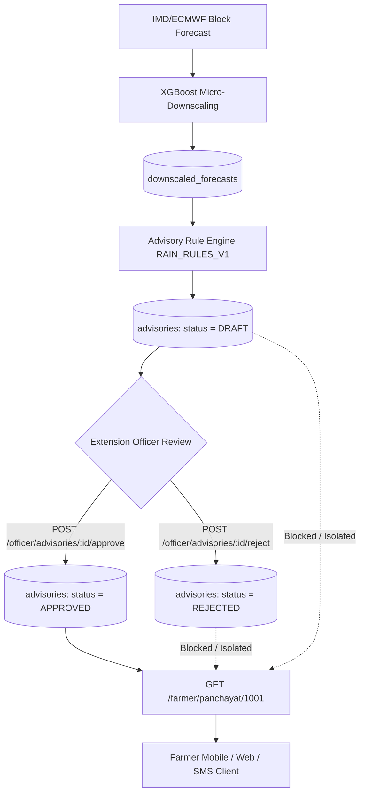

# Day 5 — Step 13: End-to-End Advisory Workflow Validation Report

**Validation Execution Date:** 2026-09-07  
**Target Panchayat:** `panchayat_id = 1001` (Ajmer Saundane, Baglan Block, Nashik District, Maharashtra)  
**Test Suite:** `tests/test_e2e_advisory_workflow.py`  
**Test Result:** `PASSED (100%)`

---

## 1. Executive Summary

This document certifies the end-to-end advisory lifecycle validation across meteorological ingestion, downscaled forecasting, deterministic rule-based advisory generation, extension officer governance (approval/rejection), and bilingual/multilingual farmer advisory delivery.



---

## 2. Test Environment & Target Metadata

| Property | Value |
| :--- | :--- |
| **Panchayat ID** | `1001` |
| **Panchayat Name** | Ajmer Saundane |
| **Block / Taluka** | Baglan |
| **District** | Nashik |
| **State** | Maharashtra |
| **Rule Version** | `RAIN_RULES_V1` |
| **Model Engine** | `XGBoost Regressor v1.0.0` |

---

## 3. Detailed Step-by-Step Workflow Trace

### Step 1: Ingest Panchayat Micro-Forecast
A high-resolution downscaled rainfall forecast is generated and recorded for Panchayat 1001.
- **Forecast Date:** `2026-09-08`
- **Issue Date:** `2026-09-07`
- **Downscaled Rainfall:** `28.5 mm` (Category: Moderate rainfall)
- **Database Record Created:** `downscaled_forecasts.id = 338`

---

### Step 2 & 3: Generate Advisory & Verify DRAFT Status
- **API Request:** `POST /api/v1/advisory/generate`
```json
{
  "forecast_id": 338
}
```
- **API Response (HTTP 200 OK):**
```json
{
  "id": 117,
  "panchayat_id": 1001,
  "forecast_id": 338,
  "forecast_date": "2026-09-08",
  "rainfall_mm": 28.5,
  "rainfall_category": "Moderate rainfall",
  "severity": "MODERATE",
  "advisory_title": "Moderate Rainfall Advisory for Ajmer Saundane - Irrigation Management & Soil Aeration",
  "advisory_text": "• Moderate rainfall forecast (28.5 mm). Pause routine surface irrigation to prevent moisture saturation.\n• Clear minor bund outlets to avoid localized stagnation in black cotton soil depressions.\n• Resume standard intercultural operations and weed management 24–48 hours after rain.\n• Inspect onion and vegetable nurseries for fungal root dampening.",
  "rule_version": "RAIN_RULES_V1",
  "status": "DRAFT",
  "officer_id": null,
  "officer_comment": null,
  "approved_at": null,
  "created_at": "2026-09-07T01:21:49.001625Z"
}
```
- **Verification:** Advisory is generated in `DRAFT` status; no officer metadata or approval timestamp is assigned.

---

### Step 4: Verify DRAFT Advisory Isolation on Farmer Endpoint
- **API Request:** `GET /api/v1/farmer/panchayat/1001?forecast_date=2026-09-08`
- **API Response (HTTP 200 OK):**
```json
{
  "panchayat_name": "Ajmer Saundane",
  "block_name": "Baglan",
  "district_name": "Nashik",
  "forecast_date": "2026-09-08",
  "rainfall_mm": 28.5,
  "rainfall_category": "Moderate rainfall",
  "severity": "MODERATE",
  "advisory_title": null,
  "advisory_points": [],
  "advisory_status": "NO_APPROVED_ADVISORY",
  "model_name": "XGBoost Regressor",
  "model_version": "v1.0.0",
  "language": "en"
}
```
- **Verification:** DRAFT advisory contents are strictly excluded from farmer-facing channels.

---

### Step 5: Retrieve DRAFT via Officer Endpoint
- **API Request:** `GET /api/v1/officer/advisories/117`
- **API Response (HTTP 200 OK):**
```json
{
  "id": 117,
  "panchayat_id": 1001,
  "panchayat_name": "Ajmer Saundane",
  "block_name": "Baglan",
  "district_name": "Nashik",
  "forecast_date": "2026-09-08",
  "rainfall_mm": 28.5,
  "rainfall_category": "Moderate rainfall",
  "severity": "MODERATE",
  "advisory_title": "Moderate Rainfall Advisory for Ajmer Saundane - Irrigation Management & Soil Aeration",
  "advisory_text": "• Moderate rainfall forecast (28.5 mm). Pause routine surface irrigation to prevent moisture saturation.\n• Clear minor bund outlets to avoid localized stagnation in black cotton soil depressions.\n• Resume standard intercultural operations and weed management 24–48 hours after rain.\n• Inspect onion and vegetable nurseries for fungal root dampening.",
  "rule_version": "RAIN_RULES_V1",
  "status": "DRAFT",
  "officer_id": null,
  "officer_comment": null,
  "approved_at": null,
  "created_at": "2026-09-07T01:21:49.001625Z"
}
```

---

### Step 6: Extension Officer Review & Approval
- **API Request:** `POST /api/v1/officer/advisories/117/approve`
```json
{
  "officer_id": "OFFICER_NASHIK_BAGLAN_01",
  "officer_comment": "Verified against local micro-topography. Approved for panchayat distribution."
}
```
- **API Response (HTTP 200 OK):**
```json
{
  "id": 117,
  "panchayat_id": 1001,
  "panchayat_name": "Ajmer Saundane",
  "block_name": "Baglan",
  "district_name": "Nashik",
  "forecast_date": "2026-09-08",
  "rainfall_mm": 28.5,
  "rainfall_category": "Moderate rainfall",
  "severity": "MODERATE",
  "advisory_title": "Moderate Rainfall Advisory for Ajmer Saundane - Irrigation Management & Soil Aeration",
  "advisory_text": "• Moderate rainfall forecast (28.5 mm). Pause routine surface irrigation to prevent moisture saturation.\n• Clear minor bund outlets to avoid localized stagnation in black cotton soil depressions.\n• Resume standard intercultural operations and weed management 24–48 hours after rain.\n• Inspect onion and vegetable nurseries for fungal root dampening.",
  "rule_version": "RAIN_RULES_V1",
  "status": "APPROVED",
  "officer_id": "OFFICER_NASHIK_BAGLAN_01",
  "officer_comment": "Verified against local micro-topography. Approved for panchayat distribution.",
  "approved_at": "2026-09-07T01:21:50.724000Z",
  "created_at": "2026-09-07T01:21:49.001625Z"
}
```
- **Verification:** State transitioned cleanly from `DRAFT` to `APPROVED` with officer credentials and audit timestamp.

---

### Step 7 & 8: Retrieve Approved Advisory via Farmer Endpoint
- **API Request (English):** `GET /api/v1/farmer/panchayat/1001?forecast_date=2026-09-08&lang=en`
- **API Response (HTTP 200 OK):**
```json
{
  "panchayat_name": "Ajmer Saundane",
  "block_name": "Baglan",
  "district_name": "Nashik",
  "forecast_date": "2026-09-08",
  "rainfall_mm": 28.5,
  "rainfall_category": "Moderate rainfall",
  "severity": "MODERATE",
  "advisory_title": "Moderate Rainfall Advisory for Ajmer Saundane - Irrigation Management & Soil Aeration",
  "advisory_points": [
    "Moderate rainfall forecast (28.5 mm). Pause routine surface irrigation to prevent moisture saturation.",
    "Clear minor bund outlets to avoid localized stagnation in black cotton soil depressions.",
    "Resume standard intercultural operations and weed management 24–48 hours after rain.",
    "Inspect onion and vegetable nurseries for fungal root dampening."
  ],
  "advisory_status": "APPROVED",
  "model_name": "XGBoost Regressor",
  "model_version": "v1.0.0",
  "language": "en"
}
```

- **API Request (Marathi):** `GET /api/v1/farmer/panchayat/1001?forecast_date=2026-09-08&lang=mr`
- **API Response (HTTP 200 OK):**
```json
{
  "panchayat_name": "Ajmer Saundane",
  "block_name": "Baglan",
  "district_name": "Nashik",
  "forecast_date": "2026-09-08",
  "rainfall_mm": 28.5,
  "rainfall_category": "मध्यम पाऊस",
  "severity": "MODERATE",
  "advisory_title": "Ajmer Saundane साठी मध्यम पाऊस सल्ला - सिंचन व्यवस्थापन आणि जमीन निचरा",
  "advisory_points": [
    "मध्यम पावसाचा अंदाज (28.5 मिमी). अतिरिक्त पाणी साचू नये म्हणून ठिबक/बागायती सिंचन तात्पुरते थांबवा.",
    "काळ्या जमिनीच्या सखल भागात पाणी साचू नये म्हणून बांधावरील पाण्याचे मार्ग मोकळे करा.",
    "पाऊस थांबल्यानंतर २४-४८ तासांनी आंतरमशागत आणि तण काढणीची कामे सुरू करा.",
    "कांदा व भाजीपाला रोपवाटिकांमध्ये बुरशीजन्य रोगांचा प्रादुर्भाव तपासा."
  ],
  "advisory_status": "APPROVED",
  "model_name": "XGBoost Regressor",
  "model_version": "v1.0.0",
  "language": "mr"
}
```

- **API Request (Hindi):** `GET /api/v1/farmer/panchayat/1001?forecast_date=2026-09-08&lang=hi`
- **API Response (HTTP 200 OK):**
```json
{
  "panchayat_name": "Ajmer Saundane",
  "block_name": "Baglan",
  "district_name": "Nashik",
  "forecast_date": "2026-09-08",
  "rainfall_mm": 28.5,
  "rainfall_category": "मध्यम वर्षा",
  "severity": "MODERATE",
  "advisory_title": "Ajmer Saundane के लिए मध्यम वर्षा सलाह - सिंचाई प्रबंधन एवं जल निकासी",
  "advisory_points": [
    "मध्यम बारिश का अनुमान (28.5 मिमी)। मिट्टी में अधिक नमी से बचने के लिए नियमित सिंचाई रोकें।",
    "खेतों में पानी भराव रोकने के लिए मेड़ों के निकास मार्ग साफ करें।",
    "बारिश बंद होने के 24-48 घंटे बाद ही निराई-गुड़ाई और जुताई कार्य फिर से शुरू करें।",
    "प्याज और सब्जी नर्सरी में फफूंद जनित रोगों की जांच करें।"
  ],
  "advisory_status": "APPROVED",
  "model_name": "XGBoost Regressor",
  "model_version": "v1.0.0",
  "language": "hi"
}
```

---

## 4. Rejection & Immutability Workflow Validation

A separate forecast was generated for `2026-09-09` with heavy rainfall (`95.0 mm`, `forecast_id = 339`, `advisory_id = 118`).

### A. Officer Rejection
- **API Request:** `POST /api/v1/officer/advisories/118/reject`
```json
{
  "officer_id": "OFFICER_NASHIK_BAGLAN_01",
  "officer_comment": "Manual raingauge calibration differs; rejecting draft."
}
```
- **API Response (HTTP 200 OK):**
```json
{
  "id": 118,
  "status": "REJECTED",
  "officer_id": "OFFICER_NASHIK_BAGLAN_01",
  "officer_comment": "Manual raingauge calibration differs; rejecting draft.",
  "approved_at": null
}
```

### B. Verification of Farmer Isolation for Rejected Advisories
- **API Request:** `GET /api/v1/farmer/panchayat/1001?forecast_date=2026-09-09`
- **Response:**
  - `advisory_status`: `"NO_APPROVED_ADVISORY"`
  - `advisory_title`: `null`
  - `advisory_points`: `[]`
- **Result:** Rejected advisories are strictly never exposed to farmers.

### C. Verification of Immutability Constraint
Attempting to approve an already `REJECTED` advisory:
- **API Request:** `POST /api/v1/officer/advisories/118/approve`
- **Response (HTTP 400 Bad Request):**
```json
{
  "detail": "Cannot approve advisory with ID '118' because it has been REJECTED. Create a new revision instead."
}
```
- **Result:** State machine prohibits transitioning `REJECTED` -> `APPROVED`.

---

## 5. Security & Privacy Audit

| Checked Item | Status | Verification Detail |
| :--- | :--- | :--- |
| **No Model Weights / Feature Vector Leaks** | PASS | Farmer schema only exposes user-friendly `model_name` and `model_version`. |
| **No Officer ID Exposed to Farmers** | PASS | `officer_id` and internal comments are omitted from `FarmerForecastResponse`. |
| **No Unapproved Draft Exposure** | PASS | Farmer endpoints return `NO_APPROVED_ADVISORY` for draft/rejected states. |
| **Deterministic Localization** | PASS | Translations (`mr`, `hi`) dynamically mapped via static catalog without unverified LLM generation. |

---

## 6. Conclusion
The End-to-End Advisory Workflow successfully satisfies all acceptance criteria for **Day 5 — Step 13**.
